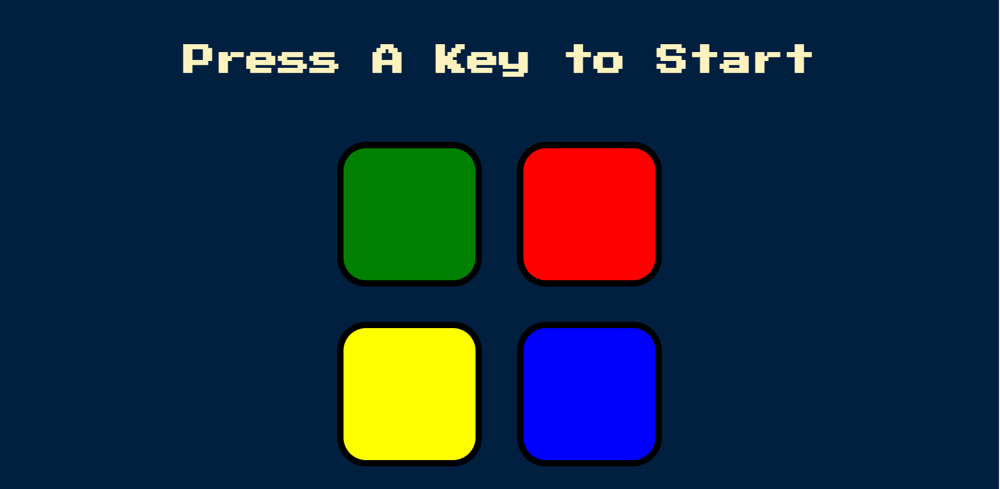

<h1 align="center"> Drum Kit </h1>

 
  

  <a href="https://aaeb-simon-game.netlify.app/">Live Page</a>

## Description

This is a simple Drum Kit project built using HTML, CSS, and JavaScript. It allows users to play the drums on their computer by pressing corresponding keys. Each key is associated with a different drum sound and a visual animation.

## Usage

To use the Drum Kit, follow these steps:

1. Visit the live page link above.
2. Click on any of the drum buttons or press the corresponding keys to play the drums.
3. Enjoy the sound and visual effects!

## Technologies Used

The Drum Kit was built using the following technologies:

- HTML
- CSS
- JavaScript

## Contributing

If you'd like to contribute to the Drum Kit project, feel free to fork this repository and submit a pull request.

## Credits

The Drum Kit project was inspired by the increasing popularity of virtual instruments and music software.

## License

This project is licensed under the MIT License. See the LICENSE file for details.
